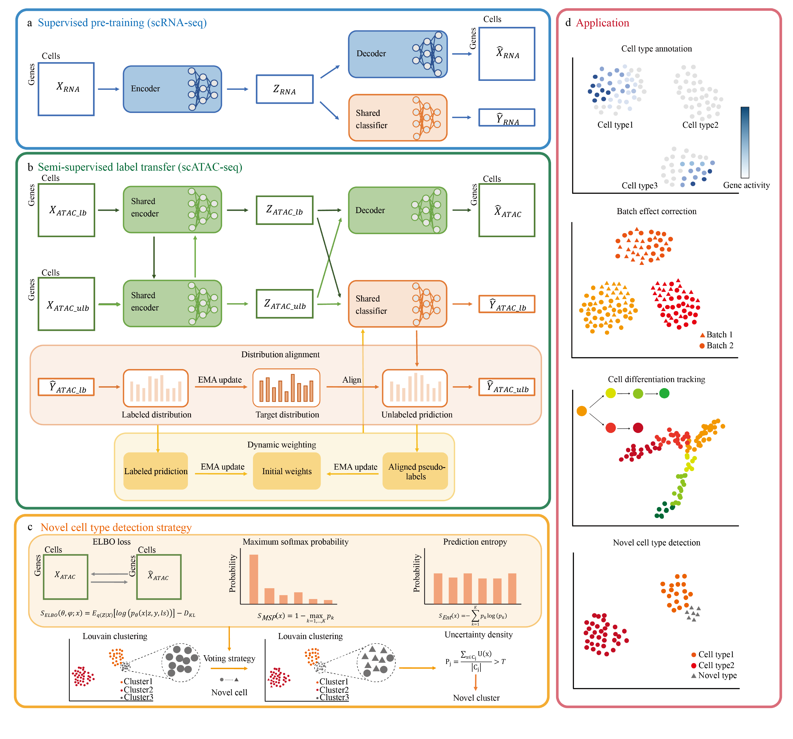

# CARA: Robust annotation and discovery of novel cell types in single-cell ATAC-seq data through cross-modal reference alignment



## Installation

Recommended to use a fresh conda environment.

- Requirements
  - Python 3.9
  - PyTorch 1.12.1 (CUDA 11.6 build recommended for GPU)

Steps
```bash
conda create -n cara python=3.9 -y
conda activate cara
```

GPU (CUDA 11.6)
```bash
pip install --index-url https://download.pytorch.org/whl/cu116 \
  torch==1.12.1+cu116 torchvision==0.13.1+cu116 torchaudio==0.12.1+cu116
```

Install dependencies
```bash
git clone https://github.com/Ying-Lab/CARA
cd CARA
pip install -r requirements.txt
```

## Quick Start

- Fastest way: use the bundled notebook
  1) Launch Jupyter: `jupyter lab` or `jupyter notebook`  
  2) Open and run `Cara kidney demo.ipynb` or `Cara CITE-ASAP demo.ipynb` step by step  
  3) In the initial `Config` cell, set:
     - `RNA_PATH`, `ATAC_PATH` (paths to data `.h5ad`)
     - `OUTPUT_PATH` (directory for results)
     - optional: `USE_CUDA`, `BATCH_SIZE`, `EPOCHS`, `PREFIX`
  4) The notebook will run: Data preprocessing → RNA warm‑up → ATAC training → evaluation & visualization → saving results

- Outputs
  - Metrics of prediction result such as accuracy, F1, precision
  - The output directory will contain model weights (`.pkl`) and UMAP figures, e.g.:
    - `<prefix>_predict_label.pdf`
    - `<prefix>_actual_label.pdf`

## Data

- Input consists of two AnnData objects: RNA expression and ATAC (gene‑activity transformed) matrices, typically saved as `.h5ad`.
- Required field
  - `adata.obs['cell_type']`: cell type labels
- Optional field
  - `adata.obs['batch']`: batch information (defaults to 0 in the pipeline if absent)


## Identify Novel Cell Types
See Cara CITE-ASAP demo.ipynb for a complete workflow.

- The required obsm keys ('embedding', 'prob', 'elbo_loss') are produced during evaluation. 
- After evaluation, you can detect novel cells using the combined uncertainty voting strategy.
- Core APIs are in `util/detection.py`
```python
from util.detection import novel_cluster_detection, label_novel_cells_as_unknown

cluster_results = novel_cluster_detection(
    testadata,
    resolution=0.3,
    n_neighbors=30,
    auto_params=True
)
# Relabel cells in novel clusters as 'unknown'
testadata = label_novel_cells_as_unknown(testadata, cell_type_key='predictions')
```

## Notebook Examples

- Kidney workflow (baseline end‑to‑end pipeline): `Cara kidney demo.ipynb`
- CITE‑ASAP (includes novel class detection and relabeling): `Cara CITE-ASAP demo.ipynb`
